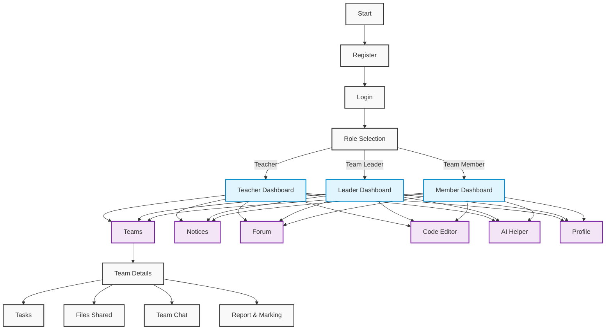

```mermaid
graph TD
    %% Main Flow
    Start[Start] --> Register[Register]
    Register --> Login[Login]
    Login --> RoleSelection[Role Selection]

    %% Role-based Flows
    RoleSelection -->|Teacher| TeacherDashboard[Teacher Dashboard]
    RoleSelection -->|Team Leader| LeaderDashboard[Leader Dashboard]
    RoleSelection -->|Team Member| MemberDashboard[Member Dashboard]

    %% Teacher Features
    TeacherDashboard --> Teams[Teams]
    TeacherDashboard --> Notices[Notices]
    TeacherDashboard --> Forum[Forum]
    TeacherDashboard --> CodeEditor[Code Editor]
    TeacherDashboard --> AIHelper[AI Helper]
    TeacherDashboard --> Profile[Profile]

    %% Leader Features
    LeaderDashboard --> Teams
    LeaderDashboard --> Notices
    LeaderDashboard --> Forum
    LeaderDashboard --> CodeEditor
    LeaderDashboard --> AIHelper
    LeaderDashboard --> Profile

    %% Member Features
    MemberDashboard --> Teams
    MemberDashboard --> Notices
    MemberDashboard --> Forum
    MemberDashboard --> CodeEditor
    MemberDashboard --> AIHelper
    MemberDashboard --> Profile

    %% Styling
    classDef default fill:#f9f9f9,stroke:#333,stroke-width:2px;
    classDef role fill:#e1f5fe,stroke:#0288d1,stroke-width:2px;
    classDef feature fill:#f3e5f5,stroke:#7b1fa2,stroke-width:2px;

    class TeacherDashboard,LeaderDashboard,MemberDashboard role;
    class Teams,Notices,Forum,CodeEditor,AIHelper,Profile feature;

    Teams --> TeamDetails[Team Details]
    TeamDetails --> Tasks[Tasks]
    TeamDetails --> Files[Files Shared]
    TeamDetails --> Chat[Team Chat]
    TeamDetails --> Report[Report & Marking]
```
